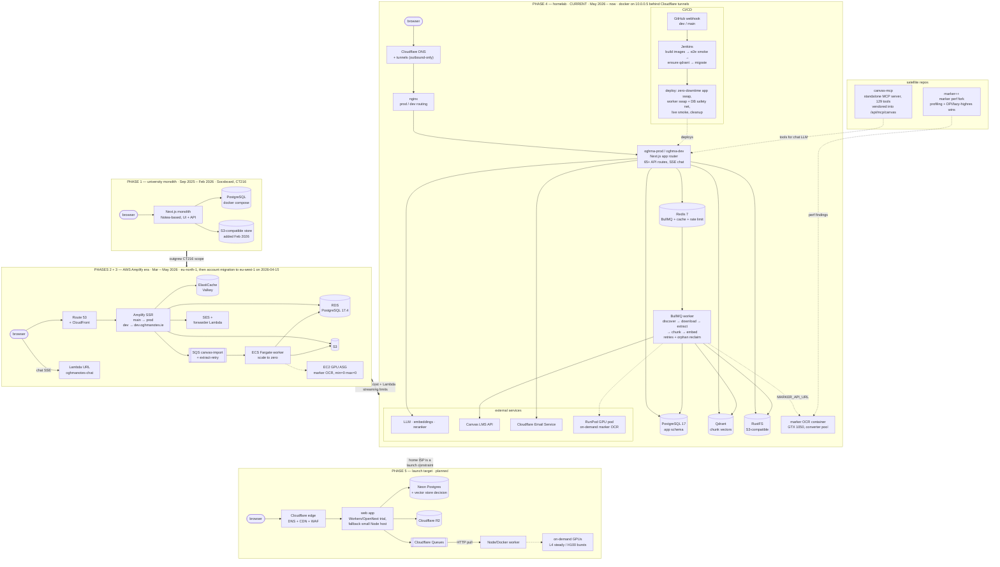

# architecture evolution

the full OghmaNotes architecture history in **one mega mermaid diagram**: five infrastructure phases stacked in chronological order (top = oldest, bottom = planned), evolution arrows labeled with why each phase ended, and the two satellite repos (canvas-mcp, marker++) feeding into the current stack. renders on GitHub, in Obsidian, and via `mmdc` (use a puppeteer config with `--no-sandbox` on this machine).

note on numbering: these are **infrastructure phases**. the product roadmap in [ROADMAP.md](ROADMAP.md) has its own phase 0–4 numbering (launch blockers → beta → soft launch → growth); a mapping table is at the bottom.

## the mega chart

read top to bottom — each yellow band is one era. phase 4 is the running system today.

## phase notes

### phase 1 — university monolith (Sep 2025 – Feb 2026)

started 2025-09-11 as **Socsboard**, a CT216 group project at University of Galway (three-person team), renamed to Oghma on 2026-02-24. built on the Notea (MIT) editor scaffold; one Next.js process against local containers. key events: auth flows (Oct–Nov 2025), Docker deployment support (Nov 2025), Notea editor extraction and S3 storage foundation (Feb 2026), UUID v7 migration, Canvas ingestion groundwork and first RAG pipeline (Mar 2026). ~750 commits by end of March.

### phases 2 + 3 — AWS Amplify era (Mar – May 2026)

first production deployment: Amplify SSR + CloudFront + Route 53, RDS PostgreSQL, ElastiCache Valkey, S3, two SQS queues, a scale-to-zero ECS Fargate import worker, a Lambda URL for chat streaming, SES with a forwarder Lambda, Secrets Manager, and a GPU ASG for marker OCR held at min=0. phase 3 was a **full cross-account migration** (723920043097 / eu-north-1 → 877013879182 / eu-west-1, 2026-04-15) — same architecture, new account; the complete export lives in `aws-export/`. lessons: Lambda ceilings hurt chat streaming (SSE now streams from the app process), and fixed base cost (NAT, RDS, ElastiCache) dominated a pre-revenue budget.

### phase 4 — homelab (May 2026 – now, current)

migrated 2026-05-05. everything is Docker on one Ubuntu 24.04 box (30 GB RAM, GTX 1050) behind outbound-only Cloudflare tunnels — no open inbound ports. Jenkins runs the full pipeline per branch: parallel app/worker image builds → e2e smoke gate (compose services, integration tests + Playwright) → ensure qdrant → migrations → zero-downtime prod app swap → worker swap (in-flight jobs reclaimed via a DB safety net) → live health smoke → image cleanup. the import pipeline is BullMQ on Redis (`canvas-import` + delayed `extract-retry`, backoff 30s/2m/8m/15m; worker concurrency 10 jobs / 6 files / OCR 2 / embed 3). chunk vectors moved from pgvector to **Qdrant** on 2026-06-18. OCR has two serving paths behind one client contract (`src/lib/ocr.ts`): the homelab marker container (FastAPI + converter pool) and on-demand RunPod pods (`oghma-marker:v0.2-baked`; measured: B200 auto-sized to 22 workers, request-concurrency 8 was the throughput knee, page-limited runs hit 90–96% GPU utilization), with in-process pdf-parse as the fallback. explicitly an **interim** stack — home ISP upload/reliability is a launch constraint.

### phase 5 — launch target (planned)

Cloudflare for edge/R2/email, Neon Postgres, Cloudflare Queues feeding a plain Node/Docker worker over HTTP pull, and on-demand GPUs (L4-class serverless for the steady queue, H100 bursts for onboarding cohorts). the web app tries Workers/OpenNext first with a small Node host as fallback. open reconciliation point: [../infra/TARGET_HOSTING.md](../infra/TARGET_HOSTING.md) (2026-06-15) plans Neon **pgvector**, but the app moved chunk vectors to **Qdrant** three days later — before launch either the target adopts a hosted Qdrant or vectors move back to pgvector; the `src/lib/qdrant.ts` boundary keeps that swap contained.

### satellite repos

- **canvas-mcp** (`~/code/personal/canvas-mcp`) — standalone TypeScript MCP server merged from twelve open-source Canvas MCP servers: 129 tools across 15 domains, streamable HTTP, stateless, 30s timeout with retry on 5xx. vendored into the app at `src/lib/canvas-mcp/` and hosted at `/api/mcp/canvas` behind internal-token auth, so the chat LLM can call live Canvas data mid-conversation. Canvas's own permission model gates every call.
- **marker++** (`~/code/personal/marker++`) — fork of datalab's marker for import-pipeline economics: stage profiling found low-res DPI and lazy high-res rendering as the big levers, plus table-OCR guards. its findings shaped the RunPod image; the fork itself is not yet installed in any serving path.

## reliability engineering highlights

- **zero-downtime deploys** — prod app swap is start-new → health-check → cut-over; worker swap relies on queue redelivery plus a DB safety net for in-flight jobs.
- **graceful degradation** — OCR falls back marker → pdf-parse; rate limiting falls back redis → in-memory; reranker falls back to vector order; chat has a no-RAG mode.
- **idempotency + recovery** — import jobs have terminal-state idempotence, cancellation flags, orphan reclamation on a timer, and delayed retry lanes with exponential backoff.
- **observability** — structured logging with secret redaction, per-stream chat lifecycle events (explicit `done` markers make truncation visible), health endpoints gated in CI and post-deploy, GPU benchmarks logged with `nvidia-smi dmon` correlation.
- **migration discipline** — three full migrations (account→account, AWS→homelab, homelab→launch target planned) follow the same runbook shape: parallel build, data copy, verify, DNS cutover last, rollback path kept warm.
- **measured capacity decisions** — GPU sizing from benchmark tables (workers-per-VRAM, concurrency knees, p95), not vendor specs; a written break-even rule for when a bigger GPU is worth renting.

## roadmap phase mapping

| product phase (ROADMAP.md) | runs on infra phase |
|---|---|
| phase 0 — launch blockers | 4 (homelab) |
| phase 1 — controlled beta, ~20 UoG users | 4 (homelab, explicitly acceptable for a closed cohort) |
| phase 2 — soft launch, first paid users | 5 (Cloudflare + Neon + R2 target) |
| phase 3/4 — growth | 5, scaled (longer GPU windows, tuned queues) |

## sources

built from `infra/HOMELAB.md`, `infra/AWS_INFRASTRUCTURE.md`, `infra/MIGRATION_RUNBOOK.md`, `infra/TARGET_HOSTING.md`, `aws-export/INFRASTRUCTURE.md`, `Jenkinsfile`, `docs/HANDOVER_2026-07-02.md`, the marker++ and canvas-mcp repos, and current code (`src/lib/qdrant.ts`, `src/lib/ocr.ts`, `src/lib/canvas/worker-entry.ts`, `src/app/api/mcp/canvas/route.ts`). where docs disagreed with code, code won — notably the June 2026 pgvector → Qdrant move.
