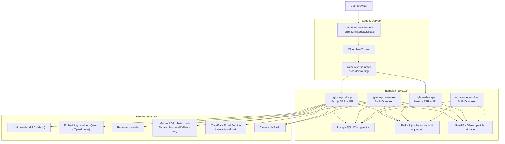
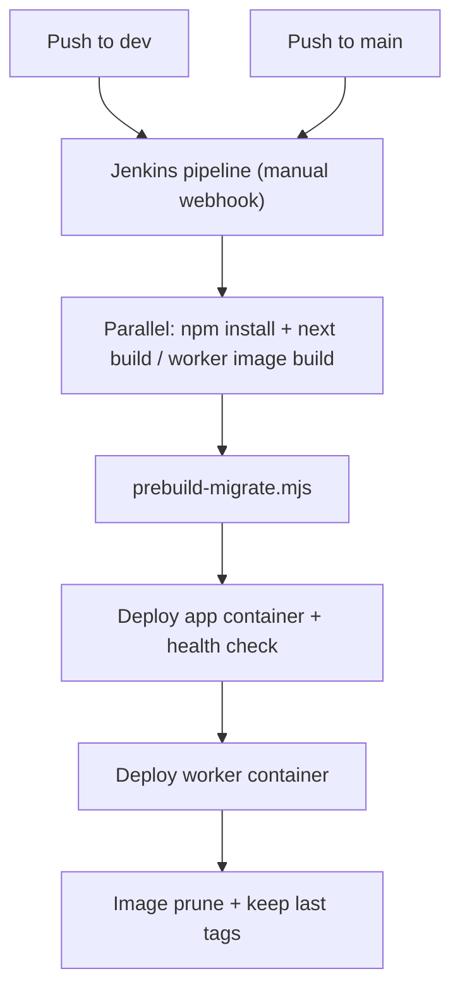
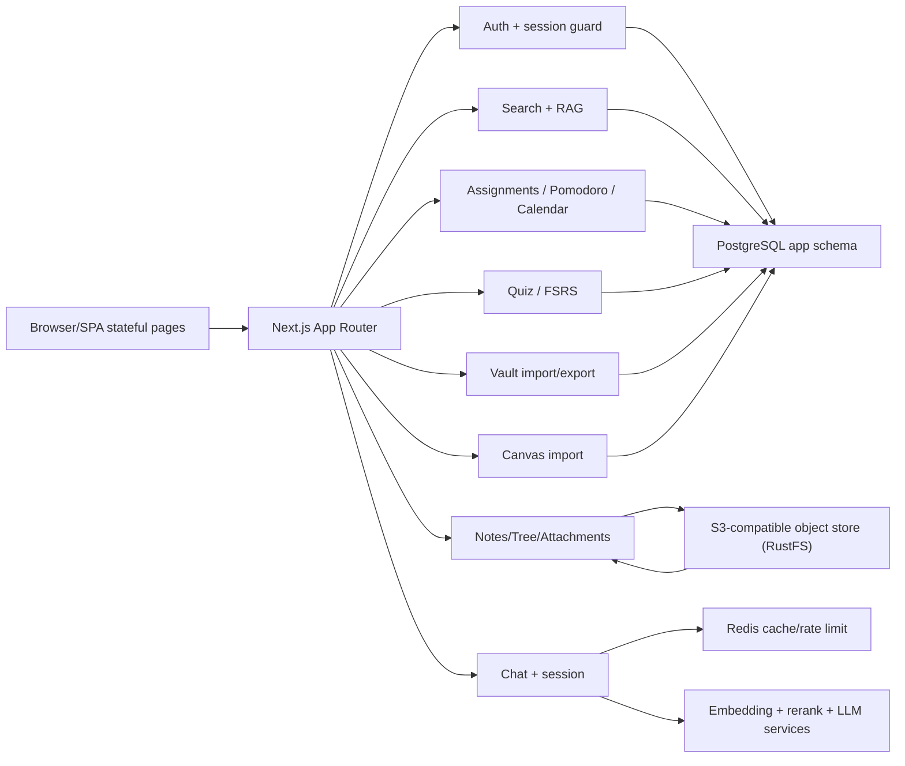
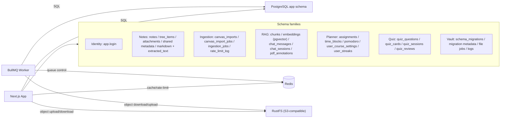
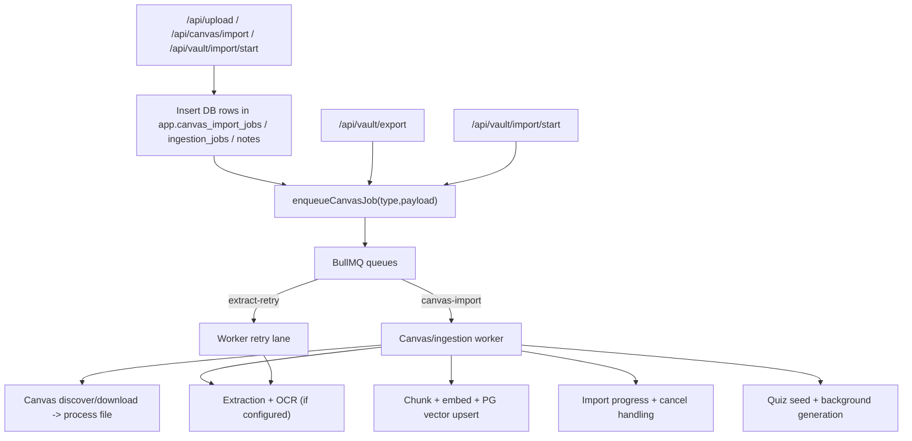
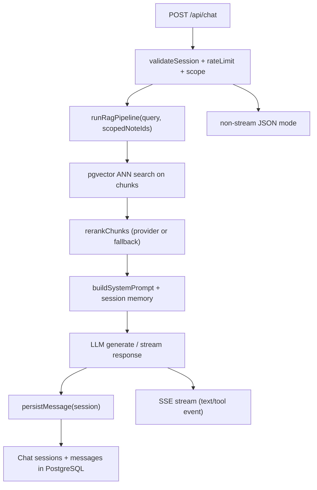

# OghmaNotes Architecture Atlas (Obsidian)

Created: 2026-06-11
Status: Current homelab/code snapshot, not the launch target.

Launch target note: this file describes the running homelab architecture derived from `main`, `infra/HOMELAB.md`, and `Jenkinsfile`. For the go-forward paid-launch provider split, use `../infra/TARGET_HOSTING.md`: Cloudflare DNS/edge/email/R2, Neon Postgres + pgvector, Cloudflare Workers/OpenNext if the trial is clean, otherwise a small Node/Docker runtime, and on-demand GPU batches for import processing.

## 1) System-Level Architecture

OghmaNotes is currently a **Next.js App Router monolith** plus a **separate BullMQ worker** container, both deployed from `main`/`dev` branches through Jenkins onto a homelab Docker stack.

## 2) Deployment and runtime pipeline

- Branch mapping:
  - `dev` branch → `oghma-dev` / `oghma-dev-worker`
  - `main` branch → `oghma-prod` / `oghma-prod-worker`
- Env + images are passed from `Jenkinsfile` and stored in `/home/semyon/jenkins/env/{oghma-prod,oghma-dev}.env`.
- Container stack command in dev uses `docker-compose` with static names and fixed IPs.
- Migrations run via `scripts/prebuild-migrate.mjs` against `MIGRATION_DATABASE_URL`.

## 3) Request flow overview (UI → API → domain logic)

## 4) Domain inventory by filesystem

### App layer (`src/app`)

- **Pages / UI shells**: `about`, `blog`, `calendar`, `chat`, `notes`, `quiz`, `pricing`, `settings`, `syntax-guide`, `login/register/password/reset/verify`, etc.
- **API route roots**:
  - `assignments`
  - `auth`
  - `calendar`
  - `canvas`
  - `chat`
  - `courses`
  - `extract`
  - `health`
  - `import-export`
  - `ingestion-status`
  - `mcp`
  - `notes`
  - `pdf`
  - `pomodoro`
  - `quiz`
  - `search`
  - `settings`
  - `time-blocks`
  - `trash`
  - `tree`
  - `upload`
  - `vault`

### Full API route inventory (all `route.ts` / `route.js` files found)

- `src/app/api/assignments/route.ts`
- `src/app/api/assignments/[id]/route.ts`
- `src/app/api/assignments/sync/route.js`
- `src/app/api/auth/[...nextauth]/route.ts`
- `src/app/api/auth/avatar/route.ts`
- `src/app/api/auth/avatar/image/route.ts`
- `src/app/api/auth/change-password/route.js`
- `src/app/api/auth/delete-account/route.ts`
- `src/app/api/auth/login/route.js`
- `src/app/api/auth/logout/route.js`
- `src/app/api/auth/me/route.js`
- `src/app/api/auth/password-reset/request/route.js`
- `src/app/api/auth/password-reset/verify/route.js`
- `src/app/api/auth/register/route.js`
- `src/app/api/auth/resend-verification/route.js`
- `src/app/api/auth/verify-email/route.js`
- `src/app/api/calendar/ical/[token]/route.ts`
- `src/app/api/calendar/token/route.ts`
- `src/app/api/canvas/connect/route.js`
- `src/app/api/canvas/courses/route.js`
- `src/app/api/canvas/import/route.js`
- `src/app/api/canvas/logs/route.js`
- `src/app/api/canvas/status/route.js`
- `src/app/api/canvas/sync/route.js`
- `src/app/api/chat/route.ts`
- `src/app/api/chat/sessions/route.ts`
- `src/app/api/chat/sessions/[id]/route.ts`
- `src/app/api/chat/sessions/[id]/messages/[messageId]/route.ts`
- `src/app/api/courses/settings/route.ts`
- `src/app/api/courses/settings/[courseId]/route.ts`
- `src/app/api/extract/route.ts`
- `src/app/api/health/route.js`
- `src/app/api/import-export/route.ts`
- `src/app/api/ingestion-status/route.ts`
- `src/app/api/mcp/canvas/route.ts`
- `src/app/api/notes/route.js`
- `src/app/api/notes/[id]/route.js`
- `src/app/api/notes/[id]/assets/route.ts`
- `src/app/api/notes/[id]/share/route.ts`
- `src/app/api/pdf/annotations/route.js`
- `src/app/api/pomodoro/route.ts`
- `src/app/api/quiz/cards/[id]/route.ts`
- `src/app/api/quiz/dashboard/route.ts`
- `src/app/api/quiz/dashboard/courses/route.ts`
- `src/app/api/quiz/questions/[id]/related/route.ts`
- `src/app/api/quiz/review-dates/route.ts`
- `src/app/api/quiz/sessions/route.ts`
- `src/app/api/quiz/sessions/[id]/route.ts`
- `src/app/api/quiz/sessions/[id]/answer/route.ts`
- `src/app/api/quiz/streak/route.ts`
- `src/app/api/search/route.ts`
- `src/app/api/settings/route.ts`
- `src/app/api/time-blocks/route.ts`
- `src/app/api/time-blocks/[id]/route.ts`
- `src/app/api/trash/route.ts`
- `src/app/api/tree/route.ts`
- `src/app/api/tree/children/route.ts`
- `src/app/api/tree/status/route.ts`
- `src/app/api/upload/route.ts`
- `src/app/api/vault/route.ts`
- `src/app/api/vault/export/route.ts`
- `src/app/api/vault/import/route.ts`
- `src/app/api/vault/import/start/route.ts`
- `src/app/api/vault/jobs/[jobId]/cancel/route.ts`
- `src/app/api/vault/status/route.ts`

## 5) Library/services inventory (`src/lib`)

- **Core platform**
  - `api-error.ts`, `auth.ts`, `auth.config.ts`, `logger.ts`, `xray.ts`, `metrics.ts`, `trace.ts`, `cache.ts`, `redis.ts`, `rateLimiter.ts`, `rateLimitConfig.ts`
- **Persistence and storage**
  - `storage/*` abstraction layer (`StoreS3`, init, logger, s3 tools)
  - `notes/storage/*` (`pg-tree.js`, `s3-storage.ts`, `note-cleanup.ts`)
  - `auth-oauth.ts`, `crypto.ts`, `email.js`
- **Notes + document pipeline**
  - `notes/*`, `ingestion/extraction-core.ts`, `extract*` flow, `rag/indexing.ts`, `ingestion-status`, `chunking.ts`
- **AI/RAG**
  - `ai-config.ts`, `embeddings.ts`, `rerank.ts`, `providers/self-hosted-*`
  - `chat/*` (rag pipeline, tool calling, streaming SSE, sessions, prompts, normalizers, hooks)
- **Canvas import platform**
  - `canvas/*`, `queue.ts`, `canvas-mcp/*`
  - `canvas/worker-entry.js`, `canvas/import-worker.js`, `canvas/import-discovery.js`, `canvas/import-extraction.js`, `canvas/import-embedding.js`, `extraction-retry.ts`
- **Vault import/export**
  - `vault/import-worker.js`, `vault/export-worker.js`, `vault/tree-builder.js`
- **Search/Quiz/Planner**
  - `quiz/*`, `assignments` routes (shared tables)
  - `pomodoro` components + API
  - `calendar` related modules

## 6) Data persistence & state topology

### Storage model rules

- Notes metadata/tree + quotas mostly in PostgreSQL.
- Raw attachments and derived assets in S3-compatible storage.
- AI vectors remain in PostgreSQL pgvector.
- Queue metadata and progress are also in PostgreSQL (`app.canvas_import_jobs`, `app.canvas_imports`).

## 7) Ingestion + background job architecture

- Worker safety:
  - Job retries via BullMQ options
  - DB-level orphan recovery (`stuck` + `orphaned`) in `worker-entry.js`
  - Cancellation supported via `cancel_requested_at` and idempotent terminal-state updates.

## 8) RAG + Chat architecture

- Chat supports streaming and non-stream mode from `/api/chat`.
- Session context and message parts are stored for replay.
- Tooling hook path exists (`canvas-tooling`, MCP client routes) for structured assistant actions.

## 9) Frontend and page architecture

- App pages route under `src/app` are organized around:
  - Study workspace (notes, chat, tree)
  - Planner (`calendar`, `assignments`, `time-blocks`, `pomodoro`)
  - Learning (`quiz`, `quiz sessions`)
  - Settings/profile/auth flows.
- Components are grouped by domain under `src/components/{calendar,chat,notes,pomodoro,quiz,settings,layout,...}` and share domain hooks/state providers in corresponding `src/lib/*/state` folders.
- Common UI patterns and tokens are maintained in `docs/design-system.md`, `src/app/globals.css`, and `tailwind.config.js`.

## 10) Security / policy / resilience notes

- Auth providers:
  - Google OAuth, GitHub OAuth, and credentials login via `Credentials` strategy in `next-auth`.
- Security controls:
  - CSP + security headers in `next.config.mjs`
  - Trusted origin checks in `api-error.ts`
  - Password hashing via `bcryptjs`
  - Redaction in logger output for secrets
  - Signed URLs/keys via storage provider
- Resilience:
  - Redis fallback to memory rate limiter when unavailable.
  - BullMQ queue fallback for stuck job reclamation.
  - Worker includes explicit failure and retry handling, plus DB audit logs.
- Operational:
  - App/worker memory profiles and process swap policy managed by Jenkins + Docker compose.

## 11) Migrations and operations checklist

- Migration files tracked in `database/migrations`:
  - `001` through `029`, with gaps where historical legacy versions were dropped/archived.
- App migration sequence:
  - `scripts/prebuild-migrate.mjs` bootstraps legacy version entries.
  - `scripts/run-migration.mjs --all` applies pending files using `app.schema_migrations` tracking.
- CI/CD expects successful `prebuild-migrate` before app startup in deploy stages.

## 12) Quick dependency map (external)

- PostgreSQL: `postgresql://...` (`DATABASE_URL` / `MIGRATION_DATABASE_URL`)
- Redis: `REDIS_HOST`/`REDIS_PORT` (queue + rate limit + cache)
- Storage: `STORAGE_*` environment variables (S3-compatible bucket, endpoint, creds, prefix)
- AI/Docs: `LLM_*`, `EMBEDDING_*`, `RERANK_*`, optional `DATALAB_API_KEY`, optional `MARKER_API_URL`
- Email/notifications: Cloudflare Email Service REST API using `CLOUDFLARE_ACCOUNT_ID`, `CLOUDFLARE_EMAIL_API_TOKEN`, and `EMAIL_FROM`.
- Auth callbacks: `GOOGLE_*`, `GITHUB_*`, credentials flags/env secrets.

---

This file is a compact architecture atlas. Provider decisions belong in `../infra/TARGET_HOSTING.md`.
