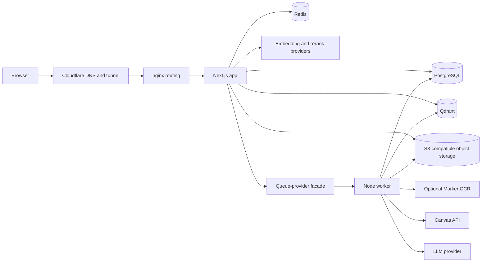

# Architecture

> **Status:** Active reference
>
> **Last reviewed:** 2026-07-20
>
> **Source of truth:** Current application code, [`Jenkinsfile`](../../Jenkinsfile), [`database/migrations/`](../../database/migrations/), and [`infra/HOMELAB.md`](../../infra/HOMELAB.md)

OghmaNotes is a Next.js App Router application with a separate long-running Node worker. The web application owns the UI, HTTP APIs, authentication, resumable chat delivery, and job submission. The worker owns LLM generation, Canvas, upload, and vault background jobs.

This page describes the running code and homelab shape. Provider migration plans belong in [`infra/TARGET_HOSTING.md`](../../infra/TARGET_HOSTING.md); operational commands belong in the operations and infrastructure runbooks.

## Runtime shape

The homelab currently runs separate prod/dev app and worker containers behind Cloudflare tunnels. Both environments share the host's stateful services but use separate databases, storage prefixes, queue prefixes, and Qdrant collections. See [`infra/HOMELAB.md`](../../infra/HOMELAB.md) for the operational topology and its isolation limits.

## Data ownership

| System | Responsibility |
|---|---|
| PostgreSQL | Users, sessions, note/tree metadata, extracted text, chunks, chat, quiz, planning, imports, and migration state |
| Qdrant | Chunk embedding vectors used by semantic search and RAG |
| S3-compatible storage | Uploaded files, note assets, exports, and other binary objects; RustFS is the current homelab provider |
| Redis | BullMQ transport, short-lived replayable chat event streams, cache, and rate-limiting support |

Qdrant is the current vector store. Migration `030_qdrant_embeddings.sql` removed the old PostgreSQL `app.embeddings` table and pgvector extension after vector data moved behind [`src/lib/qdrant.ts`](../../src/lib/qdrant.ts). PostgreSQL remains the relational source of truth for chunks and their ownership.

## Background work and queues

[`src/lib/queue.ts`](../../src/lib/queue.ts) is the queue-provider boundary for the `canvas-import`, `extract-retry`, and BullMQ-only `chat-generation` lanes.

- `QUEUE_PROVIDER=bullmq` is the default and the current homelab mode. Queue names are environment-prefixed and use Redis.
- `QUEUE_PROVIDER=cloudflare` publishes and pulls through the Cloudflare Queues HTTP API. This is the migration target supported by the same worker process, not evidence that production has switched providers.
- [`src/lib/canvas/worker-entry.ts`](../../src/lib/canvas/worker-entry.ts) runs
  either BullMQ consumers or Cloudflare pull loops, plus a PostgreSQL safety
  net for Canvas import/sync discovery jobs whose enqueue was lost.

The worker handles durable LLM generation, Canvas discovery and files, direct extraction, extraction retries, Marker completion callbacks, and vault import/export. See [Import pipeline](import-pipeline.md) for the import processing contract and tuning boundaries.

## Search and chat

Indexing stores chunk text and ownership in PostgreSQL, computes embeddings through the configured provider, and upserts vectors to Qdrant. Semantic search and chat embed the query, retrieve scoped Qdrant results, hydrate relational chunk data, optionally rerank it, and pass grounded context to the configured LLM.

Chat supports streaming and non-streaming responses. Streaming prompts are durable BullMQ jobs: the worker writes ordered SSE events to an expiring Redis Stream while PostgreSQL owns generation state and the final assistant message. A browser reconnect supplies the last Redis event ID, replays missed events, and then continues live delivery. Sessions and messages are relational data. Assistant messages retain canonical plain `content` and optional structured `parts` for durable tool and error UI.

Generations are cancellable. Every open browser tab heartbeats a per-user,
per-tab presence hash in Redis through [`src/lib/chat/presence.ts`](../../src/lib/chat/presence.ts)
and removes its own field with a `pagehide` beacon. A worker watchdog aborts
the LLM stream when the user explicitly stops (Redis cancel flag set by
`/api/chat/generations/[id]/cancel`) or when presence has been absent for a
full grace window — a real disconnect. In-app navigation and other open tabs
keep presence alive, so only closing the last tab (or a crash, via staleness)
cancels; users that never had browser presence, such as API clients, are only
ever cancelled explicitly. On abort the worker persists any partial answer as
an interrupted assistant message, marks the generation `cancelled`, and does
not retry. The inline SSE path aborts the same way when its client connection
drops.

The chat also has an always-available, read-only `getAppGuide` tool backed by
[`src/lib/chat/app-guide.ts`](../../src/lib/chat/app-guide.ts). It answers product
workflow, navigation, capability, and troubleshooting questions without using
the user's note index. The same guide renders the starter note created during
registration so those instructions have one source of truth.

## Canvas MCP boundary

The vendored standalone Canvas MCP defines **129 tools across 15 domains**.
OghmaNotes exposes a curated **83-tool hosted profile** through
[`src/lib/canvas/mcp.ts`](../../src/lib/canvas/mcp.ts). The profile removes many
instructor, grading, and administrative operations, but it still includes
user-scoped mutations such as submissions, messages, planner/calendar
changes, quiz attempts, and some deletes. Treat it as student-oriented, not
read-only or inherently safe; confirmation policy remains an upstream
responsibility.

The hosted endpoint is [`/api/mcp/canvas`](../../src/app/api/mcp/canvas/route.ts). It requires an internal user-scoped bearer token and loads that user's stored Canvas credentials. Canvas permissions still constrain every upstream request.

## Build, migration, and deployment

The Jenkins pipeline is the deploy authority. In outline it:

1. builds app and worker images;
2. runs the isolated integration/Playwright smoke gate;
3. ensures Qdrant is available;
4. applies pending migrations through `scripts/prebuild-migrate.mjs`;
5. swaps the app and worker with health checks and rollback handling;
6. runs live smoke tests before cleaning retained rollback containers and images.

`main` maps to production and `dev` maps to development. Do not encode a fixed
migration range in dependent documentation. Deployed migration state must be
checked in `app.schema_migrations`, not inferred from files alone.

## Change discipline

Update this page in the same change when any of these boundaries move:

- relational or vector ownership;
- queue provider or worker execution model;
- app/worker deployment topology;
- hosted Canvas MCP policy;
- the high-level chat or import data flow.

Avoid hand-maintained page/API route inventories here. The filesystem is the reliable inventory.
