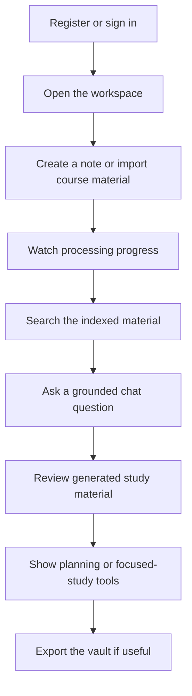

# Demo Flow

> **Status:** Active demo companion
>
> **Last reviewed:** 2026-07-11
>
> **Source of truth:** Running product behaviour; architecture details live in [Architecture](architecture.md)

The demo should tell one story: a student connects or adds course material, sees it become usable, and studies from the same workspace. Avoid turning the walkthrough into an infrastructure tour.

## Journey

## Suggested walkthrough

1. Sign in and open the protected workspace.
2. Create a folder and Markdown note to establish that the product is useful without AI.
3. Import a small, known-good Canvas item or upload a short document.
4. Show that the note/file becomes visible while extraction and indexing progress independently.
5. Wait for the indexed state, then run semantic search for a phrase from the material.
6. Ask chat a question whose answer is clearly grounded in that material; show the source context or tool activity without dwelling on internals.
7. Start a quiz session and answer a small number of cards.
8. Briefly show assignments, calendar/time blocks, or Pomodoro linkage.
9. If time permits, start a vault export and explain that imports/exports are background jobs.

## Talk track

- PostgreSQL stores notes, relationships, jobs, and study state; **Qdrant**, not pgvector, stores chunk vectors used for semantic retrieval.
- Binary files and generated assets use the configured S3-compatible object store.
- Imports use staged background work, so visibility and AI-readiness are separate milestones.
- OCR-heavy or scanned PDFs can take longer. Never promise a fixed completion time from a small demo sample.
- Provider names and deployment topology are implementation details. Use [Architecture](architecture.md) or [Import pipeline](import-pipeline.md) only when the audience asks.

## Preparation

- Use a seeded account with a small document whose content and expected search/chat answer are known.
- Confirm the app, worker, object store, Qdrant, embedding provider, and optional OCR path are healthy before the session.
- Keep a plain Markdown note as a fallback if an external provider is unavailable.
- Do not use a large course import as a live timing demonstration.
