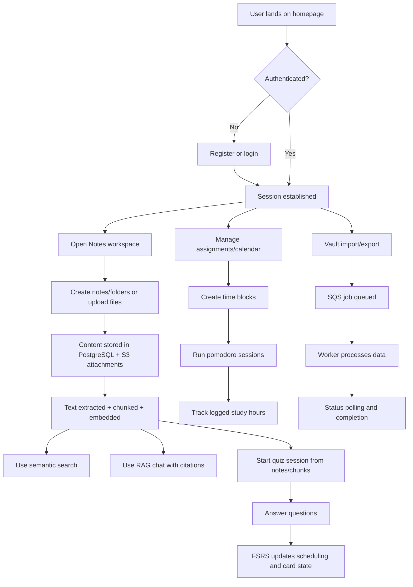
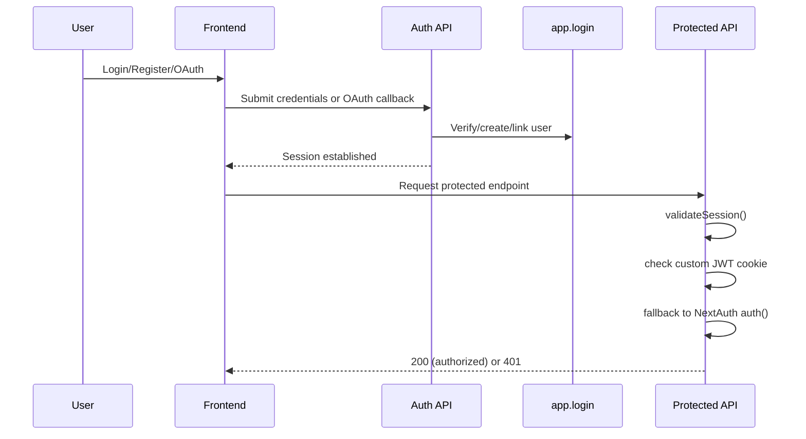
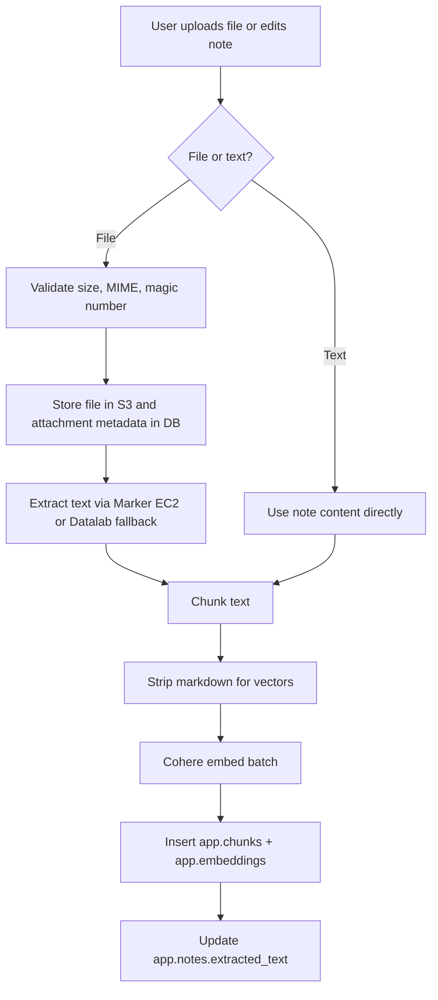
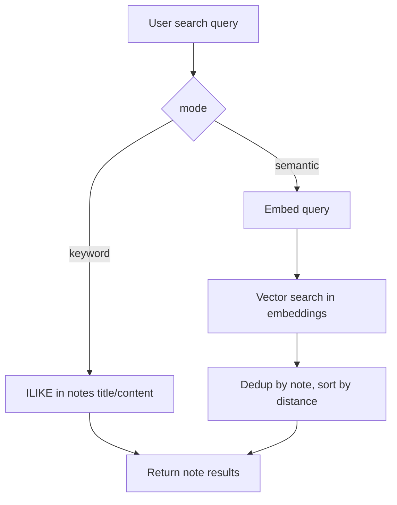
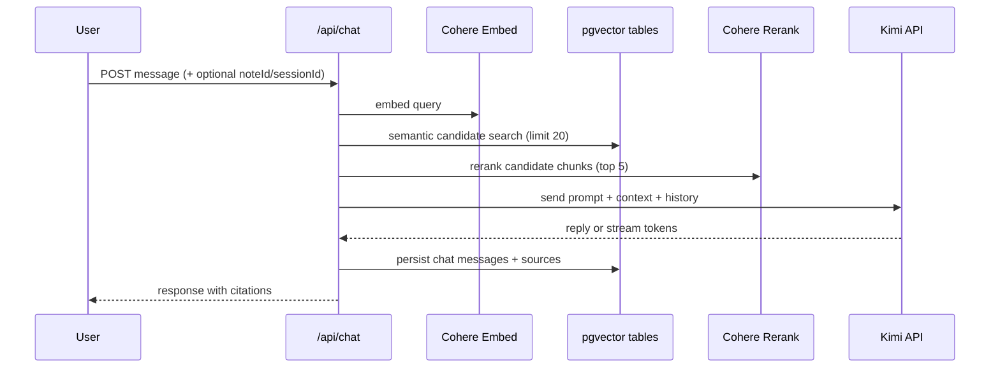
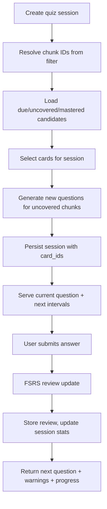
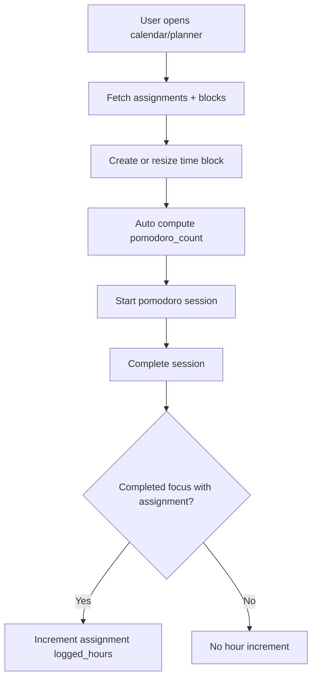
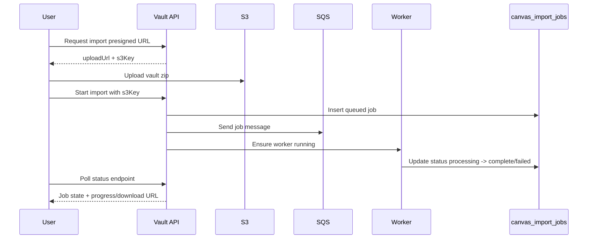
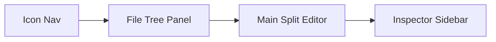

# OghmaNotes - Complete User Flow and Architecture (Demo Resource)

This document is an Obsidian-friendly demo companion that explains:

- the full end-to-end user flow
- the full system architecture
- feature-specific architecture and interaction flows

Use this as a presenter guide plus an additional technical resource during demos.

## 1) System At A Glance

OghmaNotes is a study platform built on Next.js that combines:

- markdown note-taking with folder tree management
- AI semantic search and RAG chat over personal notes
- spaced repetition quiz sessions powered by FSRS
- assignment planning with calendar, time-blocking, and pomodoro sessions
- vault import/export pipelines with async worker processing

---

## 2) Complete User Journey (High-Level)



---

## 3) Full System Architecture

```mermaid
flowchart LR
    subgraph Client[Client - Next.js React UI]
      UI1[Landing + Auth pages]
      UI2[Notes VSCode layout]
      UI3[Chat UI]
      UI4[Quiz UI]
      UI5[Calendar/Planner UI]
      UI6[Settings + Vault UI]
    end

    subgraph App[Next.js App Router + API Layer]
      APIA[/api/auth/*]
      APIN[/api/notes* + /api/tree* + /api/upload + /api/extract]
      APIS[/api/search]
      APIC[/api/chat + /api/chat/sessions*]
      APIQ[/api/quiz/*]
      APIP[/api/time-blocks* + /api/pomodoro]
      APIV[/api/vault/*]
      APICA[/api/canvas/* + /api/assignments*]
    end

    subgraph Core[Core Services]
      AUTH[validateSession: custom JWT cookie + NextAuth session]
      CHUNK[chunkText and OCR chunking]
      EMBED[Cohere embed-multilingual-v3.0]
      RERANK[Cohere rerank-multilingual-v3.0]
      LLM[Kimi k2.5 via /chat/completions]
      FSRS[ts-fsrs scheduler]
    end

    subgraph Data[Data Layer]
      PG[(PostgreSQL + pgvector)]
      S3[(AWS S3 storage)]
      SQS[(AWS SQS queue)]
      WORKER[Import/Export worker]
    end

    Client --> App
    App --> Core
    App --> Data

    APIV --> SQS --> WORKER --> PG
    APIV --> SQS --> WORKER --> S3
    APIN --> S3
    APIC --> EMBED
    APIC --> RERANK
    APIC --> LLM
    APIQ --> FSRS
    EMBED --> PG
```

---

## 4) Feature Flow - Authentication and Access Control

### Purpose

Allow credentials and OAuth sign-in while enforcing ownership checks on every protected API call.

### Key implementation points

- NextAuth providers: Google, GitHub, and optional Credentials provider.
- Session strategy: JWT (`session.strategy = "jwt"`).
- API guard pattern: `validateSession()` on protected routes.
- `validateSession()` order:
  1. custom `session` cookie JWT
  2. NextAuth `auth()` session fallback



---

## 5) Feature Flow - Notes, Upload, Extraction, and Embedding

### Purpose

Capture user knowledge from typed notes and uploaded files, then index it for retrieval.

### Key implementation points

- Upload allowlist includes PDF/text/markdown/Office/image/audio/video MIME types.
- Magic-number validation verifies file bytes match declared MIME type.
- Max upload size is controlled by `config.upload.maxFileSizeBytes`.
- Extract endpoint URL ingestion hard-limits file size to 50MB.
- Chunking strategy:
  - `chunkText(...)`: sentence-aligned chunks around 500 chars, no overlap.
  - OCR markdown split: page separator then header section grouping, target 500 chars.
- Embeddings:
  - model: `embed-multilingual-v3.0`
  - dimension: 1024
  - chunk embedding input type: `search_document`
  - batch size: 96
  - markdown is stripped before embedding; raw chunk text remains stored for RAG context.



---

## 6) Feature Flow - Semantic Search

### Purpose

Return relevant notes/chunks using keyword search and vector similarity.

### Key implementation points

- `mode=keyword` uses `ILIKE` against `title` and `content`.
- `mode=semantic`:
  - embeds query using `embed-multilingual-v3.0` with `input_type=search_query`
  - queries `app.embeddings` with pgvector cosine distance (`<=>`)
  - deduplicates by note (`DISTINCT ON note_id`), then re-sorts by best distance
  - supports client-provided `exclude` list of note IDs.



---

## 7) Feature Flow - RAG Chat

### Purpose

Answer user questions with note-grounded context and optional streaming tokens.

### Key implementation points

- Endpoint: `/api/chat`.
- Query flow:
  1. embed message (`search_query`)
  2. semantic search candidates (`limit 20`) from chunks/embeddings
  3. distance cutoff `MAX_DISTANCE = 0.75`
  4. rerank candidates with Cohere reranker (`top_n=5`, `MIN_RELEVANCE=0.15`)
  5. build system prompt grouped by note
  6. call LLM (`model` default `kimi-k2.5`, max tokens from config)
- History policy: up to last 8 request history messages (or DB session history up to 20 loaded entries).
- Streaming mode uses SSE events: `meta`, `token`, `done`, `error`.
- Chat persistence: user + assistant messages stored in `app.chat_messages`; sessions in `app.chat_sessions`.



---

## 8) Feature Flow - Quiz and FSRS Scheduling

### Purpose

Generate and schedule adaptive study questions tied to note chunks.

### Key implementation points

- Session creation resolves chunk scope from filters (course/module/note/global).
- Candidate selection combines:
  - due cards
  - uncovered chunks (no generated question yet)
  - retention cards
- New question generation uses bloom level progression and question-type selection.
- FSRS uses `ts-fsrs` state mapping:
  - `new=0`, `learning=1`, `review=2`, `relearning=3`
- Answer auto-rating currently maps:
  - correct -> `Good (3)`
  - incorrect -> `Again (1)`
- Fatigue warning triggers when answered > 4 and wrong ratio exceeds `SESSION_DEFAULTS.fatigueThreshold`.
- Leech indicator triggers when lapses exceed `SESSION_DEFAULTS.leechThreshold`.



---

## 9) Feature Flow - Planner (Assignments, Time Blocks, Pomodoro)

### Purpose

Convert assignments into executable study plans and tracked focus time.

### Key implementation points

- Time block creation requires `starts_at` and `ends_at`.
- Pomodoro estimate per block is auto-calculated as `ceil(duration_minutes / 30)`.
- Pomodoro sessions:
  - `POST /api/pomodoro` starts a session (default 25 mins, type `focus`)
  - `PATCH /api/pomodoro` ends session and marks completion
  - if completed focus session and linked assignment, increment assignment `logged_hours`.



---

## 10) Feature Flow - Vault Import/Export Jobs

### Purpose

Handle heavy import/export asynchronously and safely using queue workers.

### Key implementation points

- Import presign endpoint creates S3 upload URL for `.zip` (max 10GB).
- Start import/export creates job row in `app.canvas_import_jobs` with `queued` status.
- Existing active jobs of same type are cancelled before new job starts.
- Job message sent to SQS; worker scaling triggered (`ensureWorkerRunning`).
- Status endpoint returns latest job and progress (import) or refreshed download URL (export).



---

## 11) Main UI Composition (Demo Talking Point)

The notes workspace uses a 4-pane VSCode-style layout:

- 48px icon navigation rail
- resizable file tree panel (default ~220px)
- flexible split editor pane
- collapsible inspector panel (default ~280px)

Keyboard behavior:

- `Tab` toggles focus between split panes
- `Escape` closes the right inspector panel



---

## 12) Demo Script (Recommended Order)

1. Login/register and show protected access.
2. Create a note and folder in the tree.
3. Upload a document and explain extraction + embeddings.
4. Run semantic search and compare keyword vs semantic behavior.
5. Ask a question in chat and show note citations.
6. Start a quiz session and submit a few answers (show adaptive scheduling).
7. Open calendar, create a time block, and start/complete pomodoro.
8. Show vault import/export status flow and background job model.

---

## 13) Quick Reference - Critical Technical Values

- Embedding model: `embed-multilingual-v3.0` (1024 dimensions)
- Embedding batch size: `96`
- Query embedding input type: `search_query`
- Index embedding input type: `search_document`
- Rerank model: `rerank-multilingual-v3.0`
- Rerank top N: `5`
- Rerank min relevance: `0.15`
- Chat semantic distance cutoff: `0.75`
- Default LLM model: `kimi-k2.5`
- Default LLM max tokens: `2048`
- Default LLM timeout: `20000ms`
- Default Cohere timeout: `8000ms`
- URL extract max file size: `50MB`
- Vault import upload limit: `10GB`

---

## 14) Suggested Obsidian Links

You can link this page into your vault using:

- `[[OghmaNotes Complete User Flow and Architecture]]`
- `[[Demo Script]]`
- `[[RAG Chat Architecture]]`
- `[[Quiz FSRS Flow]]`
