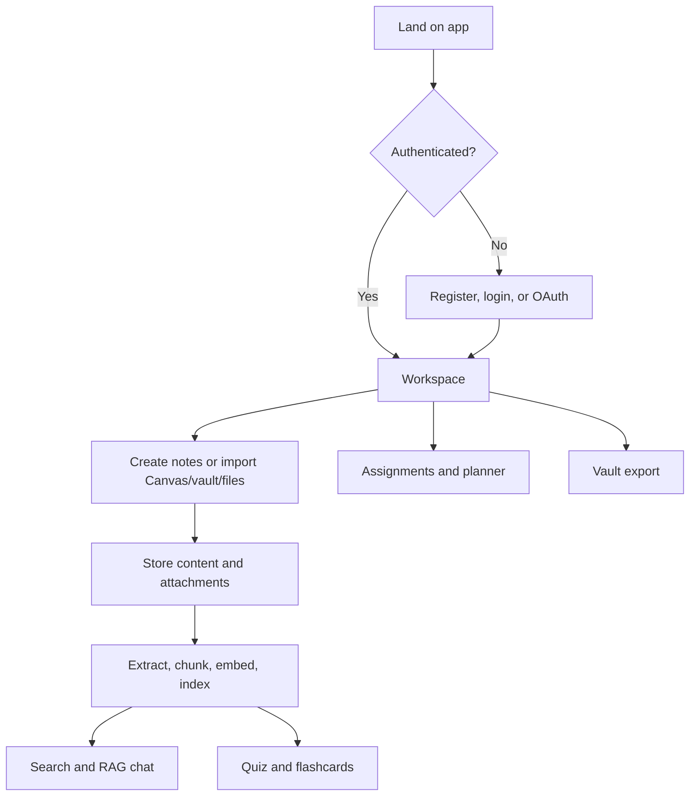
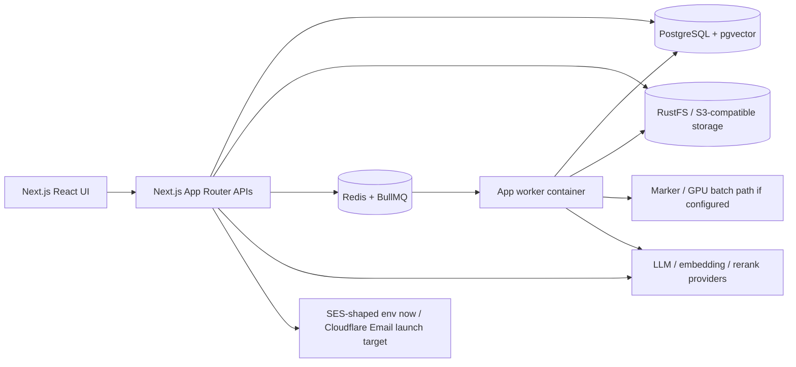

# OghmaNotes User Flow And Architecture

This is the current demo companion. It is intentionally compact so it can stay accurate as the app changes. It describes the running homelab stack; the paid-launch provider target is tracked separately in [../infra/TARGET_HOSTING.md](../infra/TARGET_HOSTING.md).

## System At A Glance

OghmaNotes combines:

- notes, folders, rich-text / markdown editing, and uploads
- Canvas LMS import into the notes tree
- background extraction, chunking, embedding, and indexing
- semantic search and RAG chat over personal notes
- quiz / flashcard study flows with FSRS scheduling
- assignment planning, time blocks, and Pomodoro logging
- vault import/export jobs

## User Journey

## Runtime Architecture

Current deployment:

- app and worker containers are built by Jenkins
- prod/dev run on the homelab behind Cloudflare tunnels
- AWS email/DNS notes are historical or fallback unless explicitly retained
- Cloudflare Email Sending, R2, Neon, and a tested app runtime are the launch migration target
- queues are BullMQ on Redis, not SQS
- object storage is RustFS/S3-compatible, not tied to AWS S3

## Feature Flows

### Auth

- Credentials auth uses custom JWT session cookies.
- NextAuth is present for Google/GitHub OAuth.
- Protected API routes use `validateSession()`.
- Email verification is hard-gated for credentials registration.
- Account deletion uses a 30-day soft-delete grace period.

### Notes, Uploads, And Indexing

1. User creates a note or uploads/imports a file.
2. Metadata and note tree state are stored in PostgreSQL.
3. Binary objects go to S3-compatible storage.
4. The worker extracts text where needed.
5. Text is chunked and embedded.
6. Embeddings are stored in pgvector-backed tables for search/chat.

Important implementation areas:

- `src/app/api/notes*`
- `src/app/api/upload/route.ts`
- `src/app/api/extract/route.ts`
- `src/lib/ingestion/`
- `src/lib/rag/`

### Canvas Import

1. User connects Canvas and selects courses/modules.
2. API inserts a job row in `app.canvas_import_jobs`.
3. API enqueues BullMQ work through `src/lib/queue.ts`.
4. Worker discovers files, downloads supported content, creates notes, and indexes content.
5. UI polls status and refreshes the tree as files become visible.

Supported job states are documented in [OPTIMIZATION_SUMMARY.md](OPTIMIZATION_SUMMARY.md).

### Semantic Search And RAG Chat

- Search/chat embeds the query.
- pgvector retrieves relevant chunks.
- The reranker provider narrows context where configured.
- The LLM answers with note-grounded context.
- Chat sessions and messages persist in PostgreSQL.
- Assistant messages store both plain `content` and structured `parts` for tool-call pills.

Key files:

- `src/lib/chat/rag-pipeline.ts`
- `src/lib/chat/chunk-search.ts`
- `src/lib/rerank.ts`
- `src/app/api/chat/route.ts`
- `src/lib/chat/session.ts`

### Quiz And FSRS

- Quiz sessions select due cards, uncovered chunks, and retention cards.
- New questions can be generated from note chunks.
- Correctness maps to FSRS review updates.
- Session state, warnings, and progress are persisted and shown in the quiz UI.

### Planner

- Assignments and time blocks are shown in the planning surfaces.
- Pomodoro sessions can log focused time back to linked assignments.
- Calendar/iCal features expose study and assignment schedules.

### Vault Import/Export

- Import uses a presigned upload URL for a zip archive.
- Import/export jobs are queued through BullMQ and tracked in `app.canvas_import_jobs`.
- Jobs persist progress with `processed_files`.
- Active job conflicts return `409` unless the caller explicitly forces replacement.
- Cancellation is cooperative through `cancel_requested_at`.

## Demo Script

1. Register/login and show protected workspace access.
2. Create a folder and note in the tree.
3. Upload a small PDF or import a small Canvas file.
4. Show status moving through import/indexing.
5. Ask chat about the imported content.
6. Run semantic search for the same topic.
7. Start a quiz session and answer a few cards.
8. Show planner/time-block surfaces.
9. Run a vault export and explain the worker job model.

## Quick Technical Values

- Embeddings use the configured `EMBEDDING_*` provider.
- Reranking uses the configured `RERANK_*` provider and falls back when unavailable.
- Chat uses the configured `LLM_*` provider.
- Vector storage is PostgreSQL + pgvector.
- Current embedding migrations target 4096-dimensional vectors.
- Canvas/vault work uses BullMQ queues: `canvas-import` and `extract-retry`.
- Vault import upload limit is modelled for large archives, but real limits should be tested before launch.
