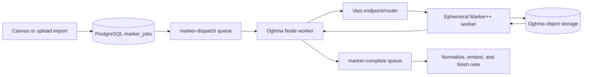

# Vast Serverless Marker Runbook

> Status: Ready-to-provision target; not live
>
> Audience: OghmaNotes operators and import-pipeline maintainers
>
> Last verified: 2026-08-04 against current Oghma code, the 2026-07-24
> Marker++ corpus evidence, Vast SDK/CLI 1.5.0, and the linked Vast
> documentation

No Vast endpoint, workergroup, worker, registry push, or paid resource was
created while preparing this runbook. The account was unfunded. Commands in
the funding-time section are intentionally inert until an operator supplies a
template hash and runs them.

## Decision

Use Vast Serverless for elastic GPU capacity, but do not make Vast the durable
queue or source of truth.

- PostgreSQL `app.marker_jobs` owns job identity, state, retry count, provider
  metadata, and recovery.
- The environment-prefixed `marker-dispatch` queue isolates long GPU waits from
  Canvas discovery, parsing, vault, and embedding work.
- Oghma object storage owns source PDFs and full Marker output.
- Vast routing owns only capacity selection, worker startup, and delivery to a
  temporary worker.
- The existing Canvas queue receives the small `marker-complete` or
  `marker-failed` continuation.



This split is deliberate. Vast describes its Serverless endpoint as the router
over workergroups and workers, while its SDK handles routing, polling, retries,
and worker lifecycle. Oghma implements the current REST envelope directly
because the application worker is Node, a use case Vast explicitly supports
through its REST API. See [Serverless architecture](https://docs.vast.ai/guides/serverless/architecture),
[SDK overview](https://docs.vast.ai/guides/serverless/sdk-overview), and
[REST introduction](https://docs.vast.ai/api-reference/introduction).

Vast instance storage is not durable: container storage disappears with the
instance, and a Vast volume is tied to a physical host. That is why signed
object URLs carry data in and out and why completion is accepted only after
Oghma can see the result object. See [Vast storage types](https://docs.vast.ai/guides/instances/storage/types).

The canonical provider-price model, dated marketplace snapshot, identical-card
RunPod comparison, storage/network economics, and funded-test cost terminal
condition live in Marker++'s
[dated Vast cost decision](https://github.com/semyonfox/marker-plus-plus/blob/main/docs/benchmarks/2026-07-27-vast-serverless-cost.md).
Keep volatile prices there rather than copying them into this operational
runbook.

## Implemented contract

| Concern | Owner and implementation |
|---|---|
| Durable job | `app.marker_jobs`, extended by migrations `057_marker_provider_dispatch.sql` and `058_marker_dispatch_guards.sql` |
| Dispatch transport | `marker-dispatch` through `src/lib/queue.ts` |
| Provider switch | `src/lib/marker-serverless.ts` |
| Vast routing client | `src/lib/vast-serverless.ts` |
| GPU route | `POST /marker/job` in `infra/vast-marker/` |
| Large payloads | Signed GET/PUT URLs; never the queue or callback body |
| Completion | `marker-complete` carries only the durable job UUID; PostgreSQL supplies the rest of the identity |
| Result contract | Versioned, size-bounded JSON bound to the callback UUID and result object key before any note/asset/chunk write |
| Recovery | Worker DB poll re-enqueues stale dispatch, completion, and failure continuations |
| Operator view | `npm run marker:serverless:status` |
| Emergency pause | `MARKER_SERVERLESS_DISPATCH_ENABLED=false` |

The result object key is generated once and is immutable. Oghma makes at most
one application-originated routed-worker request for a durable job. A lost or
ambiguous response moves the row to `awaiting_result`, where it probes that
object for `MARKER_RESULT_GRACE_SECONDS` instead of automatically spending on
another GPU call. This constrains Oghma's behavior; it is not a claim that a
provider can prove exactly-once billing or execution across its own boundary.
The worker's conditional `If-None-Match: *` result PUT must be smoke-tested
against the selected object store before launch. The Vast payload uses an opaque callback ID and result key plus a generic
`document.pdf` filename; it does not send Oghma user IDs, note IDs, or the
original user-controlled filename as separate fields.

The worker writes a strict v1 object envelope:

```json
{
  "schema_version": 1,
  "request_id": "<marker callback UUID>",
  "result_key": "marker-results/<marker callback UUID>.json",
  "success": true,
  "format": "markdown",
  "output": "...",
  "page_range": null,
  "images": {},
  "metadata": null
}
```

Oghma rejects a missing/mismatched envelope, non-Markdown output, empty
normalized Markdown, invalid page range, unsafe image name/base64/magic bytes,
or output beyond its bounded limits. The standard result-object cap is 128 MiB;
the backend and application must use the same `MARKER_MAX_RESULT_BYTES` value.

Vast SDK 1.5.0 enables DEBUG logging in PyWorker and its backend-forwarding
logger includes the full payload at that level. The tracked `worker.py`
explicitly raises that one logger to INFO so signed source/result URLs are not
written to worker logs. Re-audit this suppression whenever the Vast SDK pin
changes.

Each durable dispatch makes one Vast worker call. Router polling may repeat
while Vast finds capacity, but it does not resend the document payload to a
worker. Completion and failure continuation delivery is safely retried through
PostgreSQL and the queue; a missing/ambiguous GPU response is observed through
the immutable result object rather than redispatched.

Job states are operational state, not a public API:

| State | Meaning |
|---|---|
| `dispatch_queued` | Durable row exists and dispatch was enqueued |
| `dispatching` | Node worker is routing or awaiting a provider result |
| `awaiting_result` | A worker outcome was ambiguous; observe the immutable output object, never pay for a second automatic call |
| `completion_queued` | A result object exists and an indexing continuation is queued |
| `completing` | One database-claimed consumer is validating/indexing the result |
| `completion_retry` | A valid result needs another indexing attempt |
| `completed` | Note, asset, chunk, and vector writes plus final job statuses succeeded |
| `invalid_result` | Stored object failed the v1 envelope or safety contract |
| `dispatch_retry` | Legacy state, upgraded into `awaiting_result` on observation |
| `dispatch_paused` | Operator paused provider dispatch without discarding work |
| `enqueue_failed` | Initial dispatch queue publish failed; DB recovery will retry publication only |
| `failure_queued` | A terminal Marker failure needs its Canvas continuation published |
| `recovering` | The DB poller claimed stale work and is republishing it |
| `failed` | A terminal provider or completion failure was reflected to the import |

## Initial Vast topology

Start with one endpoint and one workergroup. Vast also recommends one
workergroup for most deployments. Do not introduce a second GPU family until
the first has corpus evidence and a clear availability or cost reason.
The initial plan restricts the workergroup to RTX 4090 rather than treating
every 24 GB GPU as binary-compatible and performance-equivalent. Add a
different measured family as a separate reviewed workergroup/profile; do not
silently widen the search query. The initial offer filter also requires a
verified host with at least 0.98 reliability, CUDA 12.9 support, 16 effective
CPU cores, 64 GB system RAM, Vast-reported `disk_bw>=500`,
`inet_down>=200`, and `inet_up>=100`, and bandwidth prices capped at
`$0.005/GB` in each direction. The query prices the template's full 80 GB
allocation and caps total recruited-worker cost at `$0.45/hour`. CPU is
explicit because the corpus evidence says the next bottleneck investigation
is the host run queue, not VRAM alone. If no offer passes, leave the work in
Oghma's durable queue and review the constraint deliberately; do not silently
remove the price cap.

The checked plan is `infra/vast-marker/serverless-plan.json`:

| Parameter | Initial value | Reason |
|---|---:|---|
| `min_load` | 0 | no paid hot floor |
| `min_cold_load` | 0 | no cold capacity floor |
| `min_workers` | 0 | avoid Vast's default inactive-worker floor |
| `cold_workers` | 0 | required for true scale-to-zero |
| `cold_mult` | 0 | do not retain speculative stopped capacity |
| `inactivity_timeout` | 300 s | release an idle worker after a short warm window |
| `max_workers` | 1 | cost and correctness gate for first launch |
| `target_util` | 0.85 | leave headroom while admission is calibrated |
| `max_queue_time` | 120 s | Vast routing is not the durable backlog |
| `target_queue_time` | 30 s | prompt scale signal without hiding work for long |
| signed URL TTL | 3,600 s | URLs are minted at dispatch and outlive the bounded worker request without remaining valid all day |

These values are explicit because Vast defaults are intentionally more
capacity-oriented than Oghma's scale-to-zero goal. Vast documents the
parameters and the exact zero-scale conditions in
[Serverless parameters](https://docs.vast.ai/guides/serverless/serverless-parameters)
and [managing scale](https://docs.vast.ai/guides/serverless/managing-scale).

`MARKER_DISPATCH_CONCURRENCY=1` means one Oghma request is offered to Vast at a
time when exactly one dispatch consumer is running. Remaining work stays
visible in Oghma's queue and database. Keep one consumer replica at launch. If
the general Node worker is later scaled horizontally, run a designated
singleton worker deployment with
`MARKER_DISPATCH_CONSUMER_ENABLED=true` and set it to `false` on the other
replicas; otherwise concurrency is multiplied per process. Increase Vast
`max_workers` and repeat the failure/cost gate before increasing the
singleton's dispatch limit, or the extra requests only create a second hidden
backlog.

## Worker capacity profiles

The tracked image uses one shared Surya vLLM server and a Marker process pool.
The PyWorker allows parallel forwarding, while the backend's single admission
semaphore defines real document concurrency.

| Profile | Marker processes | Admitted documents | Use |
|---|---:|---:|---|
| `portable-24gb` | 4 | 3 | conservative 24 GB starting pool |
| `pro6000-cu13` | 12 | 10 | measured PRO 6000 throughput/value knee |

The PRO 6000 `c12` result regressed against `c10`; do not set admission to 12
merely because twelve API processes exist. The worker records GPU utilisation,
load averages, and runnable-process peaks because the next tuning question is
CPU/run-queue pressure, not VRAM occupancy alone.

Vast requires a benchmark on exactly one PyWorker handler. The image supplies
a small deterministic readiness benchmark with the same concurrency as the
selected profile. Its workload is calculated from the real generated file
size, not an invented production size. It proves that a worker can load and
serve; it does not replace the 15-document private corpus or the Marker++ cost
report, and its synthetic throughput must not be used as a production capacity
claim. Vast's current custom-worker contract is documented in
[Creating new PyWorkers](https://docs.vast.ai/guides/serverless/creating-new-pyworkers).

The image pins Vast's official
[`start_server.sh`](https://github.com/vast-ai/pyworker/blob/2e6e8a74a17c59595651f6919076147aed17bc23/start_server.sh)
at commit `2e6e8a74a17c59595651f6919076147aed17bc23` and verifies SHA-256
`cbfcf961b5cd953c6170d4574710273c85cca89532eaa5159e729b07c2432397`
during the image build. That script handles Vast certificate generation,
worker registration, metrics, and `worker.py`. The image supplies an existing
venv and `/app/worker.py`, so the pinned script takes its
existing-environment path: it does not clone a mutable `PYWORKER_REPO` or
install packages at cold start. Do not set `PYWORKER_REPO` on this template.
The local supervisor writes exact, prefix-matched readiness/failure events and
exits the worker if either vLLM or the Marker API dies.

Hosted vision remains disabled by default and hard-capped at one conversion in
the backend. Do not raise it until provider routing, admission, timeouts, and
failure behaviour have been revalidated.

## Offline preparation

These checks do not contact Vast:

```bash
npm run marker:vast:plan
npm run test:ci -- src/__tests__/lib/vast-serverless.test.ts
python3 -m py_compile \
  infra/vast-marker/backend.py \
  infra/vast-marker/worker.py \
  infra/vast-marker/generate_benchmark_pdf.py
bash -n \
  infra/vast-marker/start-backend.sh \
  infra/vast-marker/vast-onstart.sh \
  scripts/build-vast-marker-image.sh
```

The image build is also account-independent, but it is intentionally not part
of ordinary Jenkins deployment:

```bash
VAST_MARKER_IMAGE=registry.example/oghma-marker:2026-07-25-cu129 \
MARKER_CUDA_VARIANT=cu129 \
MARKER_GPU_FAMILY=nonblackwell \
bash scripts/build-vast-marker-image.sh
```

Push only a unique, never-overwritten tag, record and scan its registry digest,
and use that tag in the Vast template. Vast's current template field is
documented as `repository/image:tag`, so the recorded digest is the
verification/rollback identity rather than the template field. The source
archive defaults to the exact Marker++ commit measured on 2026-07-24.

## Funding-time provisioning

Provisioning begins only after the operator has deliberately added a small
one-time prepaid credit balance, configured a low-balance notification, and
reviewed the account's saved-card and autobilling settings. Vast's current
documentation does not describe a hard user-configurable spending ceiling, and
a saved card may be charged to cover a negative balance. Treat the small
balance as a warning boundary, not a guaranteed cap. Workers accrue compute,
storage, and bandwidth charges according to state; stopping an endpoint can
leave inactive-worker storage charges, while destroying it stops billing. See
[Vast billing](https://docs.vast.ai/guides/reference/billing) and
[Serverless pricing](https://docs.vast.ai/guides/serverless/pricing).

1. Build, scan, and push the appropriate immutable image.
2. Render the private template command with the unique registry tag and the
   object-storage hostname (no scheme or path):

   ```bash
   npm run marker:vast:plan -- \
     --image registry.example/oghma-marker:d31ecd22-cu129-20260725 \
     --object-host objects.example
   ```

3. Create one private Vast template from the rendered command. Keep the
   tracked 80 GB ephemeral worker disk and portable profile. Do not create or
   link a Vast volume. Select **docker ENTRYPOINT**
   (`runtype=args`) and leave entrypoint arguments blank; the image entrypoint
   runs `/app/vast-onstart.sh`. Do not add SSH/Jupyter, an On-start command, or
   `PYWORKER_REPO` to the production template. Vast documents that this launch
   mode runs the image as built; SSH/Jupyter modes replace its entrypoint. See
   [Template settings](https://docs.vast.ai/guides/templates/template-settings).
   The worker template needs no Oghma database, object-storage, or Vast account
   credential; requests carry scoped signed URLs. If the image registry is
   private, configure registry authentication in Vast's private registry
   settings, never in this repository or the rendered command.
4. Obtain the template hash without copying registry credentials into this
   repository.
5. Render the exact plan:

   ```bash
   npm run marker:vast:plan -- --template-hash <VAST_TEMPLATE_HASH>
   ```

6. Review the output. The rendered template, endpoint, and workergroup commands
   change Vast account state, and workers created by the workergroup can incur
   spend; run them manually only at this gate. The create APIs are
   documented at [create endpoint](https://docs.vast.ai/api-reference/serverless/create-endpoint)
   and [create workergroup](https://docs.vast.ai/api-reference/serverless/create-workergroup).
   `test_workers=1` deliberately starts one paid worker to benchmark the new
   group; it is the first paid smoke test, not a no-cost configuration step.
7. Read the created endpoint and workergroup back. Confirm every scaling value
   and the complete offer query, including 80 GB allocation, disk/network
   minima, both bandwidth-price caps, and the total hourly ceiling. Do not
   assume omitted defaults.
8. Store the endpoint-scoped key as `VAST_MARKER_ENDPOINT_API_KEY`. Do not put
   the broad Vast account-management key in Oghma.

For a one-off diagnostic template, SSH mode is acceptable only if its On-start
script is `exec /app/vast-onstart.sh`; Vast replaces the image entrypoint in
that mode. Keep that template separate from the production workergroup.

Direct Vast workers use Vast's TLS root. `Dockerfile.worker` includes the
public certificate fetched from Vast's documented certificate URL and sets
`NODE_EXTRA_CA_CERTS` before Node starts. The pinned certificate currently has
SHA-256
`5960778b0ce081b391ca640a392259a2d9b3f87625d8d94c8cac04b1277a2afa`
and certificate fingerprint
`A1:A7:8F:9E:1A:80:6C:74:DA:D0:8B:8F:01:F5:F0:8C:73:9F:B7:0A:5B:FB:B5:2D:28:92:37:51:C2:23:45:1D`.
Re-fetch and verify it when the Vast SDK/platform certificate changes; never
disable TLS verification. Local non-container workers must set
`NODE_EXTRA_CA_CERTS` to this tracked file before Node process startup.

## Application configuration

Keep the launch gate closed while credentials and the endpoint are prepared:

```dotenv
MARKER_OCR_ENABLED=false
MARKER_SERVERLESS_PROVIDER=vast
MARKER_SERVERLESS_DISPATCH_ENABLED=true
MARKER_DISPATCH_CONSUMER_ENABLED=true
VAST_MARKER_ENDPOINT_NAME=oghma-marker
VAST_MARKER_ENDPOINT_API_KEY=<endpoint-scoped-secret>
STORAGE_PUBLIC_ENDPOINT=https://objects.example
MARKER_PROCESS_ALL_PDFS=false
MARKER_DISPATCH_CONCURRENCY=1
MARKER_COMPLETION_MAX_ATTEMPTS=3
MARKER_RESULT_GRACE_SECONDS=1800
MARKER_MAX_RESULT_BYTES=134217728
```

The tracked templates keep both Marker switches false. A live environment can
enable the intentional development gate only after the endpoint, public object
host policy, and queue configuration have passed the validation sequence below.

Use this activation sequence:

Before the guard migration, run this read-only preflight. It must return no
rows; resolve any historical duplicate deliberately rather than letting index
creation fail halfway through a deployment:

```sql
SELECT note_id, COUNT(*)
  FROM app.marker_jobs
 WHERE status NOT IN ('completed', 'failed', 'invalid_result', 'cancelled')
 GROUP BY note_id
HAVING COUNT(*) > 1;

SELECT result_key, COUNT(*)
  FROM app.marker_jobs
 GROUP BY result_key
HAVING COUNT(*) > 1;
```

1. apply migrations `057_marker_provider_dispatch.sql` and `058_marker_dispatch_guards.sql`, then deploy with OCR still disabled;
2. confirm app and worker share the same queue prefix and configuration;
3. use a non-private fixture to verify the actual object store accepts the signed conditional result PUT and rejects a second identical `If-None-Match: *` PUT with a precondition failure;
4. set dispatch concurrency to 1 and enable Marker only in development;
5. submit one small non-private PDF;
6. test a cold start, a warm request, a worker failure, a provider timeout, and
   a completion-enqueue failure; confirm that the timeout stays in `awaiting_result` and is not automatically redispatched;
7. verify the result object, note output, embeddings, terminal database state, and duplicate queue delivery;
8. before any private PDF leaves Oghma, approve the data-processing terms,
   eligible regions and host policy, then apply and read back the matching
   workergroup location constraints; if that review has not passed, use only
   redistributable/public fixtures;
9. keep dispatch concurrency at one for the private comparison corpus; any
   increase is a separately reviewed capacity/cost change after that privacy
   gate passes;
10. only then consider production or `max_workers > 1`.

Do not set `MARKER_PROCESS_ALL_PDFS=true` during the infrastructure smoke test.
That is a separate quality/cost rollout.

## Monitoring

The primary view is Oghma's durable state:

```bash
npm run marker:serverless:status
```

This reports aggregate provider/status counts, the age of outstanding work,
maximum attempts, and recent redacted errors. It does not print filenames,
user IDs, object keys, signed URLs, or credentials.

Also monitor:

- BullMQ/Cloudflare `marker-dispatch` depth and oldest age;
- `awaiting_result`, `enqueue_failed`, `completion_retry`, `failure_queued`, and `invalid_result` counts;
- p50/p95 queue wait, worker latency, and end-to-end latency from
  `provider_metrics`;
- Vast active workers and measured performance;
- result-object existence and completion-to-indexing delay;
- GPU utilisation, load average, and runnable-process peaks from result
  telemetry;
- cost per 1,000 successful documents, computed from provider billing and
  Oghma completions rather than request count.

Alert first on oldest-job age and failure rate. Queue depth alone is normal
during a burst. A useful initial page is: an outstanding job older than 30
minutes, any `enqueue_failed` older than two recovery polls, or more than 5%
terminal failures over a 15-minute window.

## Pause, recovery, and rollback

For an application-side cost stop:

```dotenv
MARKER_SERVERLESS_DISPATCH_ENABLED=false
MARKER_OCR_ENABLED=false
```

The first setting moves claimed work to `dispatch_paused`; the second prevents
new imports from choosing serverless Marker. Existing durable rows are not
deleted. Re-enable dispatch to let the recovery poller resume them.

If provider spend must stop immediately, suspend the Vast endpoint in addition
to the application flags, then read back its state. Do not delete the endpoint
or workergroup during diagnosis.

The provider client has bounded route polling and a single worker-call timeout.
When the response is lost, the durable row enters `awaiting_result`; recovery
observes the stable result object and terminalizes the job after the grace
window if it never appears. A stale `dispatching` row is moved to observation
after 30 minutes. `completion_queued`, `completion_retry`, and failed enqueue
rows are re-enqueued until validation/indexing reaches a terminal state; the
database claim prevents two completion consumers from writing the same result
at once.

Never repair this flow by editing `app.marker_jobs` manually. Fix the provider,
queue, storage, or configuration fault and let the recovery path run.

## Research boundary

Vast's Deployments feature is currently documented as beta, so this design
uses the established endpoint/workergroup/PyWorker path rather than making a
beta remote-function abstraction the production boundary. Re-evaluate that
decision only after Deployments is stable and offers a concrete operational
advantage. See [Vast Deployments](https://docs.vast.ai/guides/serverless/deployments).
